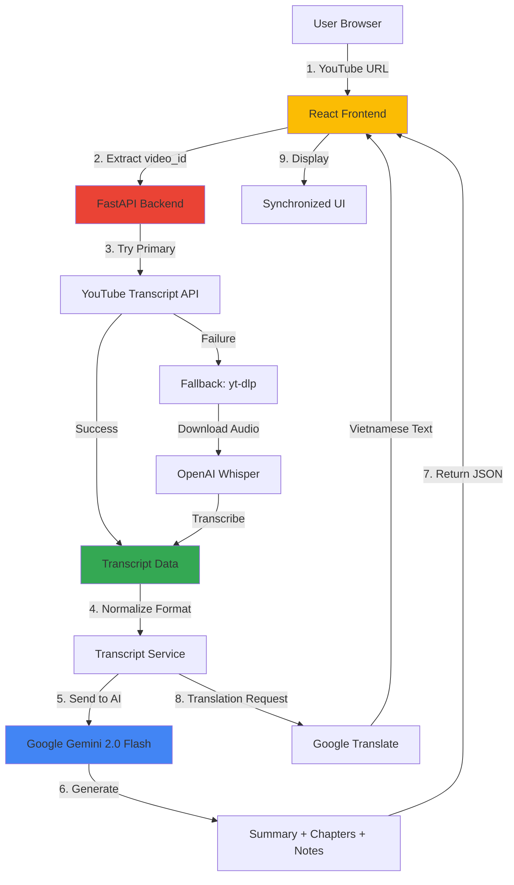

# System Architecture - Smart YouTube Analyzer

## Architecture Overview



## Data Flow

### 1. **User Input → Transcript Extraction**
```
User enters URL → Frontend extracts video_id → Backend receives request
                                                ↓
                                    Try youtube-transcript-api
                                                ↓
                                    ┌───────────┴───────────┐
                                Success                  Failure
                                    │                       │
                            Return transcript      Download audio (yt-dlp)
                                    │                       │
                                    │              Transcribe with Whisper
                                    │                       │
                                    └───────────┬───────────┘
                                                ↓
                                    Normalize to standard format:
                                    [{"text": str, "start": float, "duration": float}]
```

### 2. **AI Processing Pipeline**
```
Transcript → Gemini 2.0 Flash API
                │
                ├──→ /api/summary: "Concise video summary..."
                │
                └──→ /api/analyze: {
                        "chapters": [
                            {"timestamp": "0:00", "title": "Introduction"},
                            {"timestamp": "2:30", "title": "Main Topic"}
                        ],
                        "key_notes": [
                            {"time": "0:15", "note": "Key point 1"},
                            {"time": "3:45", "note": "Key point 2"}
                        ]
                    }
```

### 3. **Frontend Synchronization Logic**
```javascript
// Real-time sync (200ms interval)
setInterval(() => {
    const currentTime = player.getCurrentTime();
    
    // Find active transcript segment
    const activeSegment = transcript.find(seg => 
        currentTime >= seg.start && 
        currentTime < seg.start + seg.duration
    );
    
    // Highlight active text
    highlightTranscript(activeSegment);
}, 200);
```

## Component Responsibilities

### Backend (FastAPI)

#### **1. Transcript Service** (`services/transcript_service.py`)
- **Primary Method:** `youtube_transcript_api`
- **Fallback Chain:**
  1. Download audio with `yt-dlp`
  2. Transcribe using `openai-whisper`
  3. Format timestamps
- **Output Format:** Standardized JSON array

#### **2. AI Service** (`services/ai_service.py`)
- **Client:** `genai.Client(api_key=GEMINI_API_KEY)`
- **Model:** `gemini-2.0-flash-exp` (or latest Flash variant)
- **Methods:**
  - `generate_summary(transcript)` → Plain text
  - `generate_analysis(transcript)` → Structured JSON
- **Prompt Engineering:**
  - Context window optimization
  - Structured output instructions

#### **3. Translation Service** (`services/translation_service.py`)
- **Library:** `googletrans`
- **Target:** Vietnamese (`vi`)
- **Handles:** Segment-by-segment or full transcript

### Frontend (React)

#### **1. VideoPlayer Component**
- Embeds YouTube iframe
- Exposes `seekTo(timestamp)` method
- Provides `getCurrentTime()` polling

#### **2. TranscriptPanel Component**
- Renders scrollable transcript
- Auto-scrolls to active segment
- Click-to-seek functionality
- Highlights current line

#### **3. AIPanel Component**
- **Tab 1:** Summary (Markdown rendering)
- **Tab 2:** Chapters (clickable timestamps)
- **Tab 3:** Smart Notes (timestamped bullets)

## API Endpoints

| Endpoint | Method | Input | Output |
|----------|--------|-------|--------|
| `/api/transcript` | POST | `{video_id: str}` | `{transcript: [...], source: str}` |
| `/api/summary` | POST | `{transcript: [...]}` | `{summary: str}` |
| `/api/analyze` | POST | `{transcript: [...]}` | `{chapters: [...], key_notes: [...]}` |
| `/api/translate` | POST | `{text: str, target: "vi"}` | `{translated_text: str}` |

## Technology Stack

### Backend
- **Python 3.9+**
- **FastAPI** (ASGI framework)
- **youtube-transcript-api** (Primary transcript source)
- **yt-dlp** (Audio downloader)
- **openai-whisper** (Local transcription)
- **google-genai** (New Gemini SDK)
- **googletrans** (Translation)

### Frontend
- **React 18**
- **Axios** (HTTP client)
- **React Markdown** (Summary display)
- **CSS Grid/Flexbox** (Layout)

## Performance Considerations

### Whisper Fallback
- **Model Size:** Use `base` or `small` for speed
- **Processing Time:** 30s-2min for 10min video
- **GPU Acceleration:** CUDA support if available
- **Memory:** ~2GB RAM for base model

### Gemini API
- **Token Limit:** ~1M tokens (Flash models)
- **Rate Limits:** 10 requests/minute (free tier)
- **Optimization:** Chunk long transcripts (>20min videos)

### Frontend Sync
- **Polling Interval:** 200-300ms (balance CPU vs accuracy)
- **Debouncing:** Prevent excessive re-renders
- **Virtual Scrolling:** For transcripts >1000 lines

## Security Notes

- Store API keys in `.env` files (never commit)
- Use CORS middleware (restrict origins in production)
- Validate YouTube URLs before processing
- Implement rate limiting on endpoints

## Deployment Considerations

### Backend
- Deploy on: Railway, Render, or Google Cloud Run
- Ensure ffmpeg is available in container
- Set environment variables for API keys

### Frontend
- Build: `npm run build`
- Deploy on: Vercel, Netlify, or GitHub Pages
- Update API base URL for production

## Future Enhancements

1. **Multi-language Support:** Expand beyond Vietnamese
2. **Export Features:** PDF/Markdown export of notes
3. **User Accounts:** Save history and custom notes
4. **Advanced AI:** Question answering, quiz generation
5. **Playlist Support:** Batch processing multiple videos
